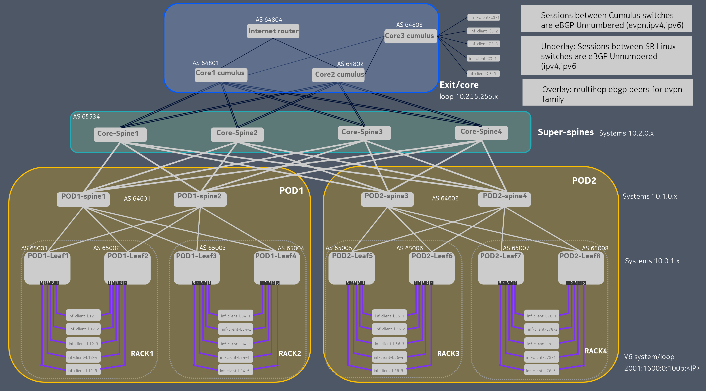
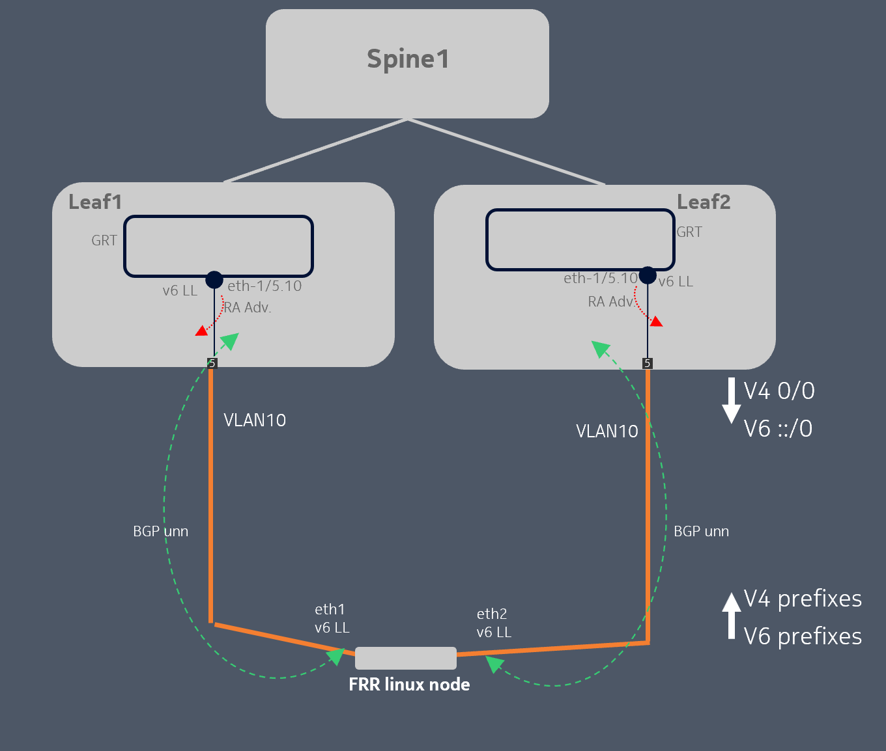
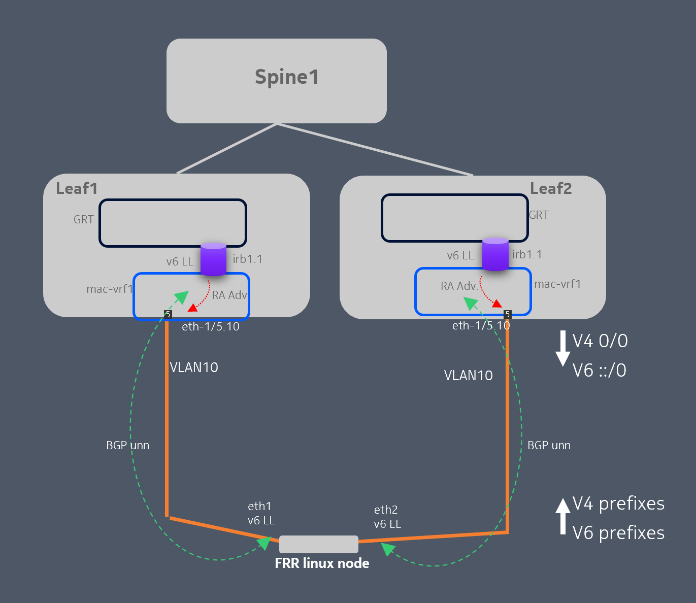
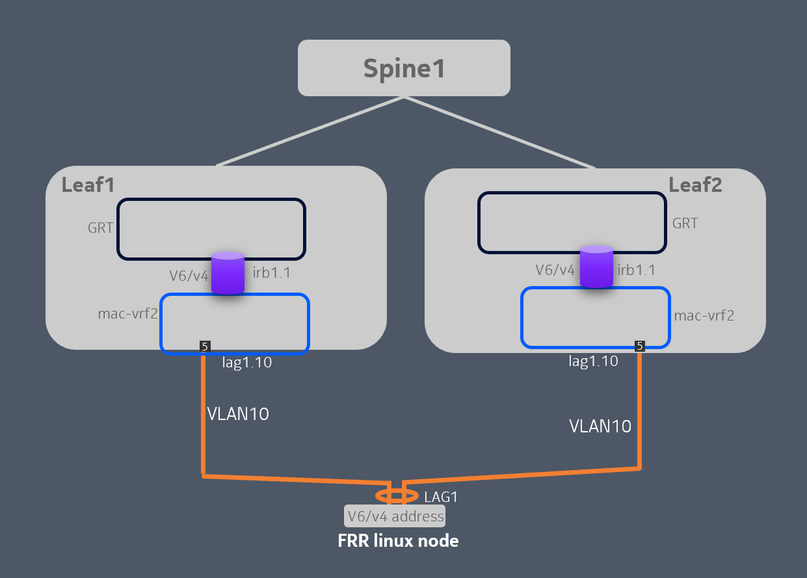
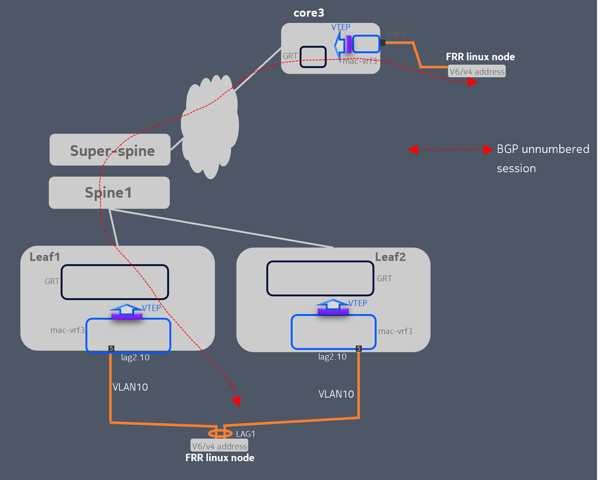
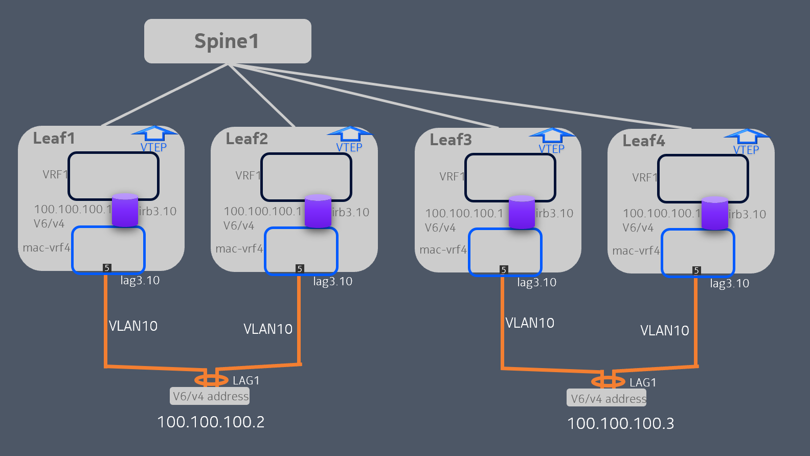
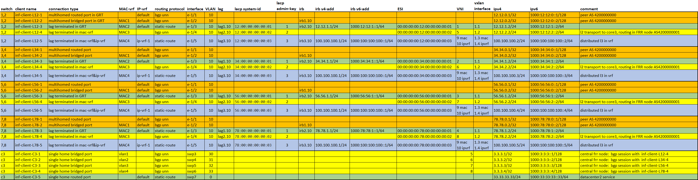

# ebgp_unn_vxlan
SR Linux BGP IPv6 Unnumbered VXLAN DC Fabric running in Containerlab

## Topology 



- Leaf, Spines, Super/Spines and Internet/router are SR Linux nodes
- Core switches are Cumulus nodes
- Clients are simulated with FRR docker images: connected to Leaf and Core3 switches
- Uses Netmiko to configure SR Linux switches

All BGP sessions are established through IPv6 link-local addresses: 

- FRRClient <-> leaf: IPv4 and IPv6 families.
- Leaf <-> Spine: EVPN, IPv4 and IPv6 families.
- Spine <-> SuperSpine: EVPN, IPv4 and IPv6 families.
- SuperSpine <-> Core: EVPN, IPv4 and IPv6 families.
- Core <-> Core: EVPN, IPv4 and IPv6 families.
- Core <-> InternetRouter: IPv4 and IPv6 families.

VXLAN VTEP termination in Leaf (SR Linux) and Core3 (Cumulus) switches.

## Requirements

- [Containerlab](https://containerlab.dev/)
- [Docker](https://docs.docker.com/engine/install/)
- [SR Linux Container image](https://github.com/nokia/srlinux-container-image)
- [Cumulus Container image](https://hub.docker.com/r/networkop/cx/tags)
- [FRR](https://quay.io/repository/frrouting/frr)
- [Netmiko](https://github.com/ktbyers/netmiko)

## Deploying the lab

```bash
# clone this repository
git clone https://github.com/michelredondo/ebgp_unn_vxlan && cd ebgp_unn_vxlan
```

```bash
# deploy containerlab topology
clab deploy
```

```bash
# Underlay SR Linux switches configuration
python create_underlay.py
```

```bash
# Overlay/Client Services SR Linux switches configuration
python create_services.py
```


## Client Connectivity use cases

### Multihomed routed port in GRT

FRR client is connected to a leaf-pair by using two routed interfaces. Two BGP unnumbered sessions (one per interface) are used to exchange v4/v6 prefixes.

Leaf switches announce default v4/v6 route. 
FRR clients announces local network.
Connection is terminated in GTR (network-instance default).



### Multihomed bridged port in GRT

FRR client is connected to a leaf-pair by using two bridged interfaces (using IRB). Two BGP unnumbered sessions (one per interface) are used to exchange v4/v6 prefixes.

Leaf switches announce default v4/v6 route. 
FRR clients announces local network
Connection is terminated in GTR (network-instance default).



### Lag port in GRT

FRR client is connected to a leaf-pair by using a bridged lag interface (using IRB). v4/v6 subnet is directly connected to Leaf-pair.
Lag interface uses Multihoming all-active EVPN Ethernet Segment procedures.

Leaf switches announce directly connected network.
FRR clients uses static routing.
Connection is terminated in GTR (network-instance default).



### Lag port in mac-vrf (Layer 2 EVPN)

FRR client is connected to a leaf-pair by using a bridged lag interface. L2 traffic is terminated in mac-vrf MAC3 and transported to inf-core3 switch by using VXLAN.
An unnumbered BGP session is established between client connected to leaf switches and client connected to inf-core3 switch (Cumulus).

Lag interface uses Multihoming all-active EVPN Ethernet Segment procedures.



### Lag port in mac-vrf&ip-vrf (Layer 3 EVPN Anycast gateways)

FRR client is connected to a leaf-pair by using a bridged lag interface (using IRB). Traffic is terminated in mac-vrf MAC4 and connected to ip-vrf1 by using IRB interface. All IRB interfaces facing the clients have the same IP address and MAC (Anycast GW configuration).

Lag interface uses Multihoming all-active EVPN Ethernet Segment procedures.




## Summary of services


